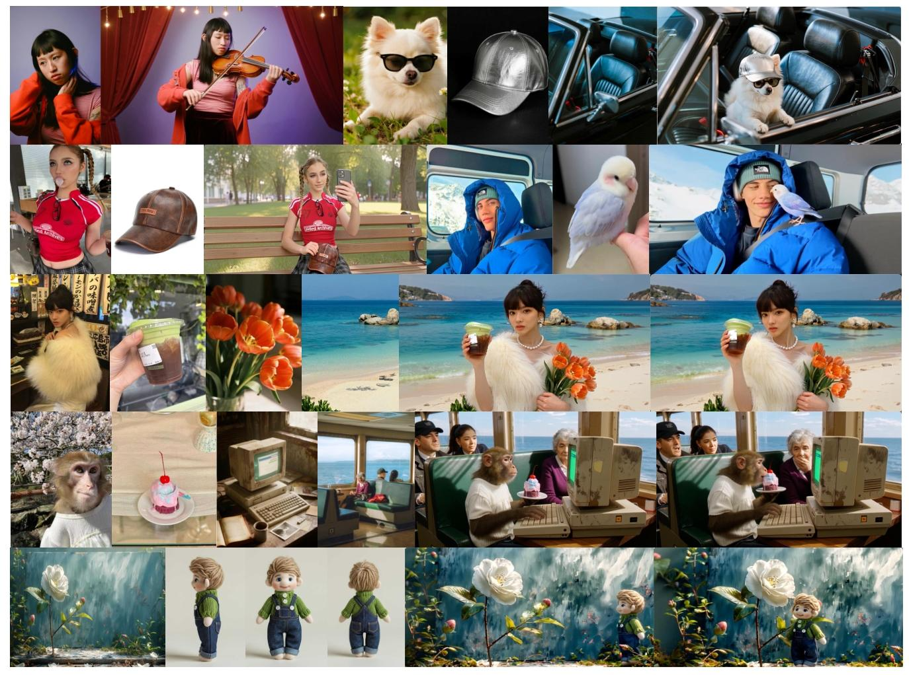
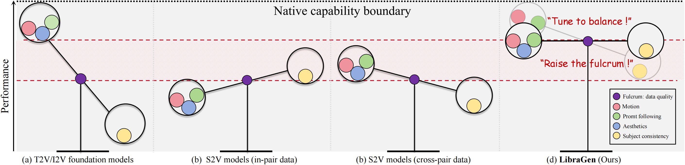
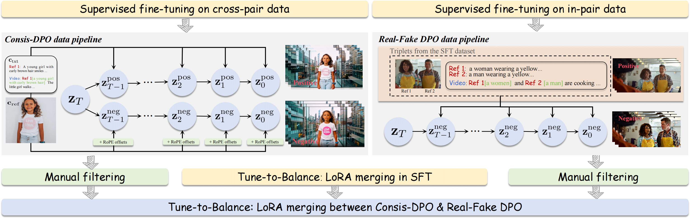

<div align="center">
<!-- <h1> LibraGen: Playing a Balance Game in Subject-Driven Video Generation </h1> -->
 <h1> LibraGen: Playing a Balance Game in Subject-Driven Video Generation </h1>

<a href="https://arxiv.org/abs/2509.17627"></a>
<a href="https://phantom-video.github.io/LibraGen/"></a>

**Jiahao Zhu***, [**ShanShan Lao***](https://scholar.google.com/citations?user=gIZam1EAAAAJ)*, [**Lijie Liu***](https://liulj13.github.io/)*, [**Gen Li***](https://scholar.google.com/citations?user=wqA7EIoAAAAJ&hl)*, [**Tianhao Qi***](https://scholar.google.com/citations?user=eU_veu0AAAAJ)*, [**Wei Han***](https://openreview.net/profile?id=~hanwei2), [**Bingchuan Li**](https://scholar.google.com/citations?user=ac5Se6QAAAAJ)* $^\dagger$, [**FangFang Liu**](https://openreview.net/profile?id=~FangfangLiu2), [**Zhuowei Chen**](https://scholar.google.com/citations?user=ow1jGJkAAAAJ), [**Tianxiang Ma**](https://tianxiangma.github.io/), [**Qian He**](https://scholar.google.com/citations?user=9rWWCgUAAAAJ), **Yi Zhou** $^\ddagger$, **Xiaohua Xie** $^\ddagger$

<sup> * </sup>Equal contribution, <sup> &dagger; </sup>Project lead , <sup> &ddagger; </sup>Corresponding author 

ByteDance, Pazhou Laboratory (Huangpu), China
</div>

<p align="center">

<p>

## 📃 Abstract
With the advancement of video generation foundation models (VGFMs), customized generation, particularly subject-to-video (S2V), has attracted growing attention. However, a key challenge lies in balancing the intrinsic priors of a VGFM, such as motion coherence, visual aesthetics, and prompt alignment, with its newly derived S2V capability. Existing methods often neglect this balance by enhancing one aspect at the expense of others. To address this, we propose <b><i>LibraGen</i></b>, a novel framework that views extending foundation models for S2V generation as a balance game between intrinsic VGFM strengths and S2V capability. Specifically, guided by the core philosophy of “Raising the Fulcrum, Tuning to Balance,” we identify data quality as the fulcrum and advocate a quality-over-quantity approach. We construct a hybrid pipeline that combines automated and manual data filtering to improve overall data quality. To further harmonize the VGFM’s native capabilities with its S2V extension, we introduce a Tune-to-Balance post-training paradigm. During supervised fine-tuning, both cross-pair and in-pair data are incorporated, and model merging is employed to achieve an effective trade-off. Subsequently, two tailored direct preference optimization (DPO) pipelines, namely <b><i>Consis-DPO</i></b> and <b><i>Real-Fake DPO</i></b>, are designed and merged to consolidate this balance. During inference, we introduce a time-dependent dynamic classifier-free guidance scheme to enable flexible and fine-grained control. Experimental results demonstrate that LibraGen outperforms both open-source and commercial S2V models using only thousand-scale training data.

## 📃 A Balance Game in Subject-to-Video Generation
<p align="center">

<p>
    (a) T2V/I2V foundation models lack task-specific training data and thus exhibit poor subject-to-video performance. 
    (b) Previous subject-to-video methods trained solely on in-pair data or 
    (c) solely on cross-pair data often overlook the inherent balance trade-off. 
    (d) LibraGen frames subject-to-video generation as a balance game, achieving superior and well-balanced performance.

## 📃 Raise the Fulcrum, Tune to Balance
<p align="center">

<p>
<b><i>Raise the Fulcrum</i></b>. Data quality acts as a critical balancing fulcrum, and its careful refinement can significantly boost overall subject-to-video performance.

<b><i>Tune to Balance</i></b>. In supervised fine-tuning, models trained on in-pair and cross-pair data exhibit complementary strengths and weaknesses in subject consistency and foundation model capabilities. We adopt a weighted model merging strategy to make a trade-off. We further design two direct preference optimization pipelines, termed Consis-DPO and Real-Fake DPO, and merge them to consolidate this balance.
## 🔥 Latest News

* **2026-03-18**: We release the [Project Page](https://phantom-video.github.io/LibraGen/) and [Technique Report](http://arxiv.org/abs/2603.13506) of **LibraGen**.

## 📑 Todo List
- [x] Release Paper
- [x] Release Project Page

## ⭐ Citation

If you find **LibraGen** helpful for your research, please consider giving us a ⭐ and citing our [paper](http://arxiv.org/abs/2603.13506).

### BibTeX
```bibtex
@misc{zhu2026libragen,
      title={LibraGen: A Balance Game in Subject-to-Video Generation}, 
      author={Jiahao Zhu and ShanShan Lao and Lijie Liu and Gen Li and Tianhao Qi and Wei Han and Bingchuan Li and Qian He and Yi Zhou and Xiaohua Xie},
      year={2026},
      eprint={2603.13506},
      archivePrefix={arXiv},
      primaryClass={cs.CV},
      url={https://arxiv.org/abs/2603.13506}, 
}
```

## 📧 Contact
If you have any comments or questions regarding this project, please contact us at zhujiahao.11@bytedance.com, and we will promptly remove them.