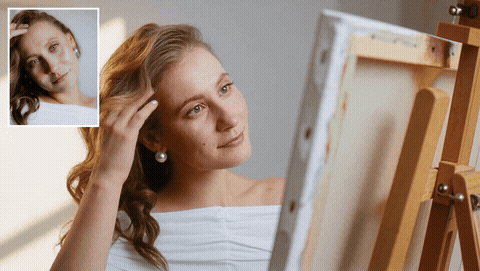
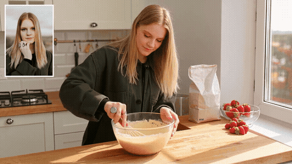
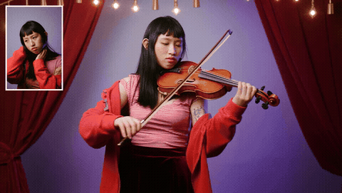
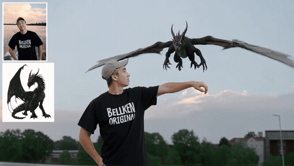
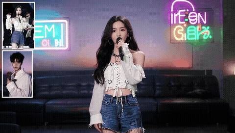
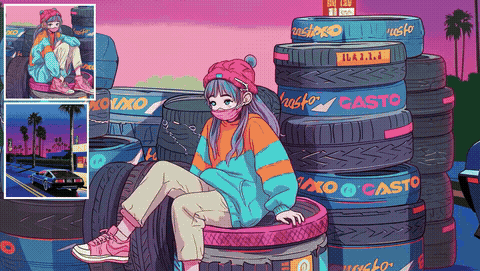
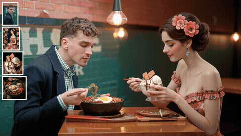
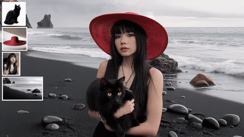
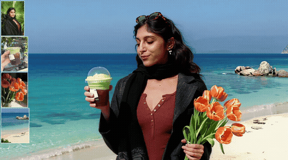

<div align="center">
<!-- <h1> LibraGen: Playing a Balance Game in Subject-Driven Video Generation </h1> -->
 <h1> LibraGen: Playing a Balance Game in Subject-Driven Video Generation </h1>

<a href="https://arxiv.org/abs/2509.17627"></a>
<a href="https://phantom-video.github.io/LibraGen/"></a>

**Jiahao Zhu***, [**ShanShan Lao***](https://scholar.google.com/citations?user=gIZam1EAAAAJ)*, [**Lijie Liu***](https://liulj13.github.io/)*, [**Gen Li***](https://scholar.google.com/citations?user=wqA7EIoAAAAJ&hl)*, [**Tianhao Qi***](https://scholar.google.com/citations?user=eU_veu0AAAAJ)*, [**Wei Han***](https://openreview.net/profile?id=~hanwei2), [**Bingchuan Li**](https://scholar.google.com/citations?user=ac5Se6QAAAAJ)* $^\dagger$, [**FangFang Liu**](https://openreview.net/profile?id=~FangfangLiu2), [**Zhuowei Chen**](https://scholar.google.com/citations?user=ow1jGJkAAAAJ), [**Tianxiang Ma**](https://tianxiangma.github.io/), [**Qian He**](https://scholar.google.com/citations?user=9rWWCgUAAAAJ), **Yi Zhou** $^\ddagger$, **Xiaohua Xie** $^\ddagger$

<sup> * </sup>Equal contribution, <sup> &dagger; </sup>Project lead , <sup> &ddagger; </sup>Corresponding author 

ByteDance, Pazhou Laboratory (Huangpu), China
</div>

<p align="center">

<p>

## 📃 Abstract
With the advancement of video generation foundation models (VGFMs), customized generation, particularly subject-to-video (S2V), has attracted growing attention. However, a key challenge lies in balancing the intrinsic priors of a VGFM, such as motion coherence, visual aesthetics, and prompt alignment, with its newly derived S2V capability. Existing methods often neglect this balance by enhancing one aspect at the expense of others. To address this, we propose <b><i>LibraGen</i></b>, a novel framework that views extending foundation models for S2V generation as a balance game between intrinsic VGFM strengths and S2V capability. Specifically, guided by the core philosophy of “Raising the Fulcrum, Tuning to Balance,” we identify data quality as the fulcrum and advocate a quality-over-quantity approach. We construct a hybrid pipeline that combines automated and manual data filtering to improve overall data quality. To further harmonize the VGFM’s native capabilities with its S2V extension, we introduce a Tune-to-Balance post-training paradigm. During supervised fine-tuning, both cross-pair and in-pair data are incorporated, and model merging is employed to achieve an effective trade-off. Subsequently, two tailored direct preference optimization (DPO) pipelines, namely <b><i>Consis-DPO</i></b> and <b><i>Real-Fake DPO</i></b>, are designed and merged to consolidate this balance. During inference, we introduce a time-dependent dynamic classifier-free guidance scheme to enable flexible and fine-grained control. Experimental results demonstrate that LibraGen outperforms both open-source and commercial S2V models using only thousand-scale training data.

## 📃 A Balance Game in Subject-to-Video Generation
<p align="center">

<p>
    (a) T2V/I2V foundation models lack task-specific training data and thus exhibit poor subject-to-video performance. 
    (b) Previous subject-to-video methods trained solely on in-pair data or 
    (c) solely on cross-pair data often overlook the inherent balance trade-off. 
    (d) LibraGen frames subject-to-video generation as a balance game, achieving superior and well-balanced performance.

## 📃 Raise the Fulcrum, Tune to Balance
<p align="center">

<p>
<b><i>Raise the Fulcrum</i></b>. Data quality acts as a critical balancing fulcrum, and its careful refinement can significantly boost overall subject-to-video performance.

<b><i>Tune to Balance</i></b>. In supervised fine-tuning, models trained on in-pair and cross-pair data exhibit complementary strengths and weaknesses in subject consistency and foundation model capabilities. We adopt a weighted model merging strategy to make a trade-off. We further design two direct preference optimization pipelines, termed Consis-DPO and Real-Fake DPO, and merge them to consolidate this balance.
## 🔥 Latest News

* **2026-03-18**: We release the [Project Page](https://phantom-video.github.io/LibraGen/) and [Technique Report](http://arxiv.org/abs/2603.13506) of **LibraGen**.

## 🎬 Show Cases
<b><i>LibraGen</i></b> can extend video generation foundation models to multi-subject driven video generation. For more clear illustration, please refer to the [Project Page](https://phantom-video.github.io/LibraGen/).

### Single Subject-Driven Video Generation
<table class="center">
  <tr>
    <td width="25%" valign="top">
      
      <details><summary><small>View Prompt</small></summary>
      <font size="1">[The woman with long, wavy brown hair] tilts her head slightly downward. Her red lips lightly touch the cup's rim as she takes a delicate sip of coffee, her eyelashes fluttering gently. A strand of hair on her right side slips down her cheek along with the movement. The liquid inside the coffee cup ripples slightly, and thin steam curls upward from the rim of the cup.</font></details>
    </td>
    <td width="25%" valign="top">
      
      <details><summary><small>View Prompt</small></summary>
      <font size="1">[The woman with light brown curly hair] runs her fingertips gently along the curve of her curls. Her gaze slowly shifts from the canvas to the window outside, and her smile softens into a warmer one. The pearl earrings sway slightly with the subtle movement of her head. In the background, an unfinished oil painting on the easel looms faintly in the light and shadow.</font></details>
    </td>
    <td width="25%" valign="top">
      
      <details><summary><small>View Prompt</small></summary>
      <font size="1">[The blonde woman with a smile on her lips] stirs the cake batter clockwise. She lifts her left hand to brush away a strand of falling hair, her gaze drifting toward the window. Sunlight draws a soft light-and-shadow line along her profile. The swirling motion creates a gentle vortex in the batter inside the bowl.</font></details>
    </td>
    <td width="25%" valign="top">
      
      <details><summary><small>View Prompt</small></summary>
      <font size="1">[A woman with long black straight-across bangs] holds the violin neck with her left hand, and her right hand holds the bow above the strings, with part of a tattoo visible on her left shoulder. The background features a gorgeous dark red stage curtain, with golden decorative lights at the top casting triangular spotlights. As she draws the bow, the vibrating strings emit a faint glow; her head sways gently with the melody, her gaze slowly lifts from the violin to the camera, and a smile appears at the corners of her mouth.</font></details>
    </td>
  </tr>
</table>

### Dual Subject-Driven Video Generation
<table class="center">
  <tr>
    <td width="25%" valign="top">
      
      <details><summary><small>View Prompt</small></summary>
      <font size="1">[A man wearing a dark hat and a black T-shirt printed with white "BELLKEN ORIGINAL"] raises his left arm; [a black dragon] flies towards him from afar and lands on his left arm, flapping its wings, the man looks towards the camera, and the camera rotates around the man and the dragon to showcase their poses.</font></details>
    </td>
    <td width="25%" valign="top">
      
      <details><summary><small>View Prompt</small></summary>
      <font size="1">Warm-toned atmosphere in a KTV private room. [A black-haired woman wearing a white strappy off-shoulder top] holds a black microphone in front of her mouth, singing soulfully with a focused gaze. Neon lights flicker in the background, and blurred shadows of the sofa and screen create a lively yet private spatial sense. The camera slowly zooms in; [a man wearing a necklace holds a rose], walks slowly towards the woman from the left side of the frame, and hands her the flower. Surprise appears in the woman's eyes, and her singing movement pauses slightly.</font></details>
    </td>
    <td width="25%" valign="top">
      
      <details><summary><small>View Prompt</small></summary>
      <font size="1">[A white man] sits in a black wheelchair, his brown curly hair fluttering slightly in the sea breeze. He wears an unbuttoned black blazer over a light blue shirt, with his hands resting naturally on his knees. [A Black man] stands behind pushing the wheelchair. He is dressed in a black knit sweater with a slightly rolled collar, and a stud earring in his right ear glints in the sun. The white man turns his head to look back at him, and both smile, showing their teeth. The blurred coastline stretches into the distance, with golden waves glistening on the sea.</font></details>
    </td>
    <td width="25%" valign="top">
      
      <details><summary><small>View Prompt</small></summary>
      <font size="1">[A vaporwave-style girl] sits beside a pile of tires, supporting herself on the ground to stand up. There is [a blue vintage sports car with blue-purple neon lights]. Finally, the camera freezes on a panoramic view of the girl standing side by side with the sports car. She turns her head and smiles. The whole scene blends street fashion and retro neon elements, creating a stylish and healing atmosphere.</font></details>
    </td>
  </tr>
</table>

### Video Generation Driven by More Than Two Subjects
<table class="center">
  <tr>
    <td width="25%" valign="top">
      
      <details><summary><small>View Prompt</small></summary>
      <font size="1">Warm and cozy restaurant atmosphere. [A curly-haired man] holds [a black stone pot filled with rich bibimbap ingredients and a golden fried egg], while on the right, [a black-haired woman with a bun] holds [a glass bowl of ice cream], gently biting the ice cream spoon. The two sit facing each other, the man with a slight smile at the corner of his mouth and the woman with a smiling gaze. Warm yellow lights glow in the background, a wooden dining table is faintly visible, creating a lazy and intimate ambiance.</font></details>
    </td>
    <td width="25%" valign="top">
      
      <details><summary><small>View Prompt</small></summary>
      <font size="1">[A woman] wearing [a red wide-brimmed straw hat] stands on [the black sand beach], holding [a black cat] gently in her arms like a mother holding a baby, with her hair flowing in the wind. The camera slowly pushes forward from a distance, focusing on the woman's face and the cat leaning on her shoulder; the black cat rubs against her affectionately, creating a warm atmosphere.</font></details>
    </td>
    <td width="25%" valign="top">
      
      <details><summary><small>View Prompt</small></summary>
      <font size="1">In [a bright kitchen with white cabinets, a sink and windows in the background, sunlight shines in]. [A baby panda] wears [a white chef hat], puts its front paws on the counter, and looks at the cake mold on the counter. It picks up the cream stick with its front paws and creams the cake. Then it handles the batter clumsily but seriously.</font></details>
    </td>
    <td width="25%" valign="top">
      
      <details><summary><small>View Prompt</small></summary>
      <font size="1">In [a bright sunny scene on an off-white beach, with a blue sea, sky, gray-brown rocks and hazy distant islands in the background], [a young woman with dark brown curly hair and brown tortoiseshell sunglasses on top of her head] stands on the off-white beach, slightly sideways, gently shaking [a cup of milk tea in a transparent plastic cup] with her right hand, [a tulip bouquet] in her left hand swaying gently with the movement, her dark brown curly hair blown slightly by the sea breeze.</font></details>
    </td>
  </tr>
</table>

## 👍 Other Remarkable Video Works
We also invite you to explore our other awesome video works:

### Human-Centric Video Generation
HuMo: Human-Centric Video Generation via Collaborative Multi-Modal Conditioning. [[Project Page]](https://phantom-video.github.io/HuMo/) [[paper]](https://arxiv.org/abs/2509.08519)

### Video Insertion
OmniInsert: Mask-Free Video Insertion of Any Reference via Diffusion Transformer Models. [[Project Page]](https://phantom-video.github.io/OmniInsert/) [[paper]](https://arxiv.org/abs/2509.17627)

### Subject-to-Video Generation
Phantom: Subject-consistent video generation via cross-modal alignment. [[Project Page]](https://phantom-video.github.io/Phantom/) [[paper]](https://arxiv.org/abs/2502.11079)

### Subject-Consistent Video Generation Dataset
Phantom-Data: Towards a General Subject-Consistent Video Generation Dataset. [[Project Page]](https://phantom-video.github.io/Phantom-Data/) [[paper]](https://arxiv.org/abs/2506.18851)

## ⭐ Citation

If LibraGen is helpful, please help to ⭐ the repo.

If you find this project useful for your research, please consider citing our paper.

### BibTeX
```bibtex
@misc{zhu2026libragen,
      title={LibraGen: Playing a Balance Game in Subject-Driven Video Generation}, 
      author={Jiahao Zhu and Shanshan Lao and Lijie Liu and Gen Li and Tianhao Qi and Wei Han and Bingchuan Li and Fangfang Liu and Zhuowei Chen and Tianxiang Ma and Qian HE and Yi Zhou and Xiaohua Xie},
      year={2026},
      eprint={2603.13506},
      archivePrefix={arXiv},
      primaryClass={cs.CV},
      url={https://arxiv.org/abs/2603.13506}, 
}
```

## 📧 Contact
If you have any comments or questions regarding this project, please contact us at zhujiahao.11@bytedance.com, and we will promptly remove them.